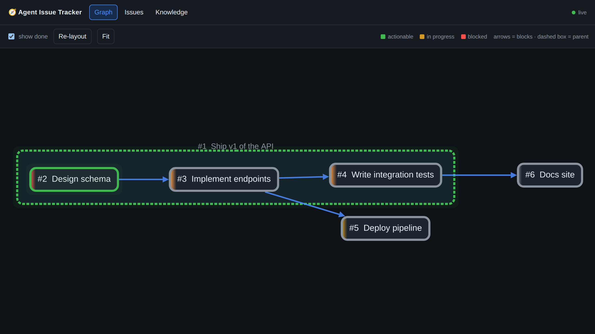

# Agent Issue Tracker

A small, local-first issue tracker and **human-gated knowledge base**, built for
coding agents to organize work and stay in sync with a human. Agents drive
everything from a terse CLI; the human watches a live dependency graph and
approves knowledge changes in a web UI.

- **Hierarchical issues** — title, description, priority (P0–P3), status,
  parent/child nesting, and a separate **dependency DAG** (`A blocks B`).
- **Agent-friendly CLI** (`issue …`) with `--json` on every read.
- **Web interface** — a Gantt-like left-to-right dependency graph (Cytoscape),
  an issue board, and a knowledge approval queue, all updating **live over SSE**.
- **Knowledge base** — a key/value store agents read freely but can only change
  with explicit **human approval**. Values can be long and are rendered as
  **markdown** (issue descriptions are too).
- **Local & private** — everything is one SQLite file in `.issues/` (git-ignored).



## Quick start

```bash
./setup.sh          # installs the `issue` CLI and builds the web UI
issue add "Design the API" -p P1
issue add "Implement the API" --depends-on 1
issue next          # -> shows #1 (unblocked); #2 is hidden until #1 is done
issue serve         # open http://127.0.0.1:8000
```

Prefer to do it by hand:

```bash
pip install -e .                       # or: uv pip install -e .
cd frontend && npm install && npm run build && cd ..
issue serve
```

The CLI works without the frontend build; only the web UI needs `npm run build`.

### `issue: command not found`?

`issue` is a console script installed into your Python environment's `bin`
directory. If that directory isn't on your `PATH`, the command won't be found
(this is common with `fish`, which has its own `PATH`).

Fixes, easiest first:

```fish
# 1. Install it as an isolated tool on your PATH (recommended; needs uv):
uv tool install --editable .
uv tool update-shell          # adds uv's bin dir to your shell (supports fish); then restart the shell

# 2. …or just add the user bin dir to fish's PATH:
fish_add_path ~/.local/bin

# 3. …or skip PATH entirely with the module fallback (make a permanent fish shim):
function issue; python3 -m issue_tracker.cli $argv; end
funcsave issue
```

For bash/zsh, `export PATH="$HOME/.local/bin:$PATH"` in your `~/.bashrc` /
`~/.zshrc` is the equivalent of option 2. `python3 -m issue_tracker.cli` always
works as long as the package is installed.

## Data model

| Concept        | Notes                                                                 |
| -------------- | --------------------------------------------------------------------- |
| **Issue**      | `title, description, status, priority, parent_id, branch, worktree, assignee, metadata(JSON)` |
| **Hierarchy**  | `parent_id` — shown as a containment box in the graph.                |
| **Dependency** | `blocker → blocked` edges (a DAG; cycles are rejected).               |
| **Actionable** | An issue that is open and has no incomplete blockers (`issue next`).  |
| **Knowledge**  | Approved `key → value`. Writes go through a pending → approved queue. |

`branch` / `worktree` / `assignee` / `metadata` are optional and exist so
multiple agents can coordinate (who owns an issue, where the work lives, linked
PR numbers, etc.).

## CLI reference

```
issue add TITLE [-d DESC] [-p P0..P3] [--parent ID] [--depends-on ID ...]
                [--branch B] [--worktree W] [--assignee A]
issue list [--status S] [--priority P] [--json]
issue next [--json]                 # open + unblocked, most important first
issue tree                          # hierarchy
issue show ID [--json]
issue update ID [--title ...] [--status ...] [--priority ...] [--parent ...]
               [--branch ...] [--worktree ...] [--assignee ...] [--meta JSON]
issue start ID | issue done ID | issue block ID
issue rm ID [-y]
issue dep add BLOCKER BLOCKED       # BLOCKER must finish before BLOCKED
issue dep rm  BLOCKER BLOCKED
issue serve [--host H] [--port N] [--reload]

issue kb list [--json]
issue kb get KEY [--json]
issue kb propose KEY VALUE [-n NOTE]      # queue a change for human approval
issue kb propose KEY --file NOTES.md      # value from a file ('-f -' for stdin)
issue kb propose-delete KEY [-n NOTE]
issue kb pending [--json]                 # what's awaiting approval
issue kb withdraw ID                      # author retracts their own pending proposal
issue kb approve ID | issue kb reject ID  # human action (also in the web UI)
```

## How the knowledge base gating works

1. An agent runs `issue kb propose deploy.url "https://prod…" -n "go live"`.
2. Nothing in the approved store changes. The proposal shows up as **pending**
   in the web UI (and `issue kb pending`) with a red/green diff.
3. A human clicks **Approve** (or **Reject**) in the web UI. Only on approval
   does the value become live and readable via `issue kb get`.

This keeps durable, shared facts under human control while still letting agents
propose updates as they learn things.

Each key has at most one live pending proposal: re-proposing a key that already
has one **supersedes** the earlier proposal instead of stacking duplicates in the
queue. An agent can also **withdraw** its own pending proposal
(`issue kb withdraw <id>`) to fix a mistake without needing a human to reject it.

## Architecture

```
src/issue_tracker/
  db.py      SQLite schema + connection (finds repo root, uses .issues/tracker.db)
  store.py   Pure data layer: issues, dependencies (cycle-checked), knowledge,
             proposals, and an append-only change_log
  app.py     FastAPI: JSON API, SSE feed (/events), hosts the built SPA
  cli.py     Typer CLI (the `issue` command)
frontend/    Vue 3 + Vite SPA (Cytoscape graph); builds into src/issue_tracker/static
skills/issue-tracker/SKILL.md   Instructions so agents use the CLI consistently
```

**Live updates work across processes.** Every mutation — whether from the CLI or
the web API — appends to a `change_log` table. The `/events` SSE endpoint tails
that table, so a `issue done 3` you run in a terminal instantly updates an open
browser graph.

### Configuration

- `ISSUE_TRACKER_DB` — override the database path (default: `<repo>/.issues/tracker.db`).

## Notes / possible extensions

- The DB is git-ignored and local to a checkout, so sync happens through the web
  UI, not git. A future option would be an export/import command or a shared
  server if multiple machines need one tracker.
- Issues intentionally carry `branch`/`worktree` fields but the tracker doesn't
  touch git itself — agents fill them in.
